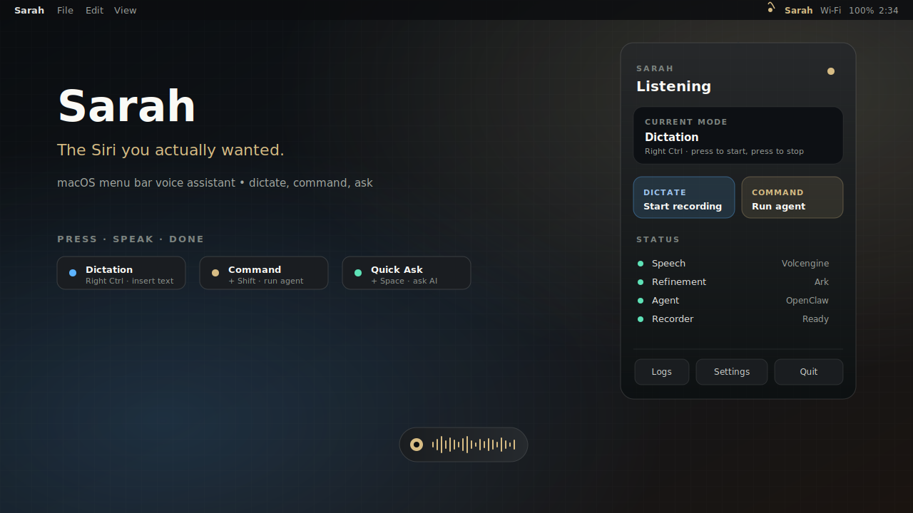
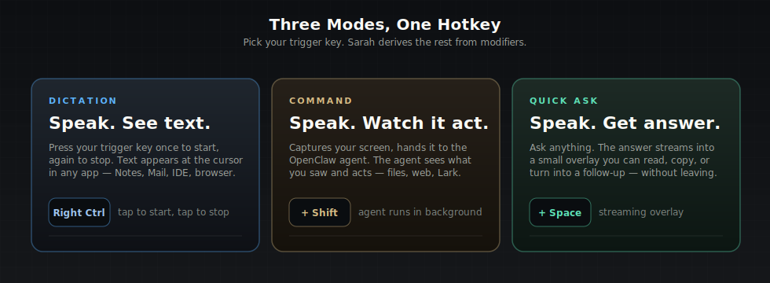
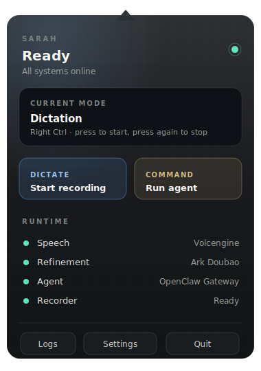
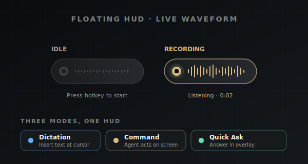
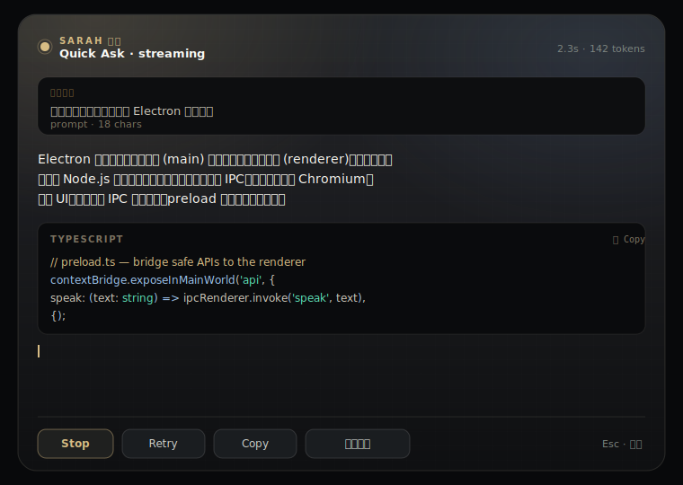
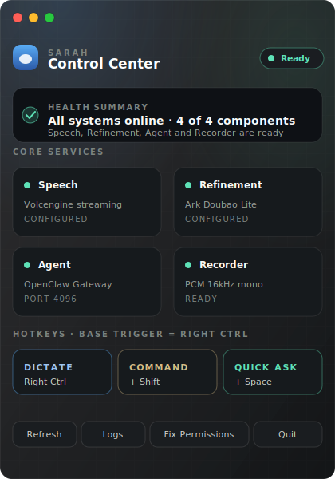
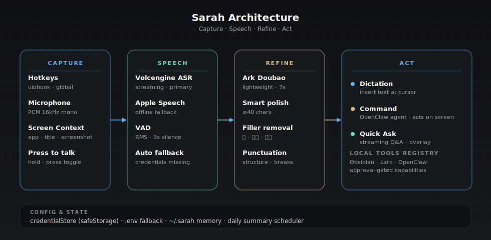

# Sarah

> The Siri you actually wanted.

<p align="center">
  
</p>

Sarah is a macOS menu bar voice assistant built with Electron. She listens through a global hotkey, transcribes speech in real time, and either drops the text at your cursor or hands it to an AI agent that can act on whatever app you were just looking at — all without leaving the keyboard.

---

## Three Modes, One Hotkey

<p align="center">
  
</p>

Pick a single trigger key. Sarah derives the other two modes from modifiers. Default trigger is **Right Ctrl**, but you can switch it to Right Alt, Right Cmd, F18 / F19, or any safe modifier in *Mini Settings → Hotkeys*.

| Mode | Hotkey | What happens |
|------|--------|--------------|
| **Dictation** | `Right Ctrl` (tap to start, tap to stop) | Speak → polished text appears at the cursor in any app |
| **Command** | `Right Ctrl + Shift` | Speak → OpenClaw agent acts on the current screen — open apps, write Lark docs, call CLIs |
| **Quick Ask** | `Right Ctrl + Space` | Speak → answer streams into a Spotlight-style overlay you can copy or follow up on |
| Quick Ask fallback | `Control + Space` | Same as Quick Ask, no Accessibility/Input Monitoring required |
| Screenshot agent | `Cmd + Shift + Space` | Capture the current window into a Command run |

---

## What it looks like

### Menubar popover — Sarah's home

<p align="center">
  
</p>

Click the Sarah icon in the menu bar. Status, mode, and runtime show at a glance. Two big buttons start a Dictation or Command run. Right-click for the legacy diagnostic menu.

### Floating HUD — live waveform

<p align="center">
  
</p>

A tiny capsule (150×40 px) appears near the top center while you're holding a recording. Real-time waveform from the mic, mode-color border, cancel button. Disappears when you stop. Stays out of your way the rest of the time.

### Answer overlay — streaming response

<p align="center">
  
</p>

Quick Ask and Command results land here. Markdown rendering with code highlighting, streaming Stop button while the answer is in flight, then `Retry`, `Copy`, `继续追问` after it finishes. Press Esc to dismiss; Cmd/Ctrl+C copies the whole answer when nothing is selected.

### Mini Settings — control center

<p align="center">
  
</p>

The 420×600 control panel that doubles as a doctor. Health summary on top, four core service cards (Speech / Refinement / Agent / Recorder), then the hotkey deck and quick actions. Refresh, Logs, Fix Permissions, Quit — that's the entire surface.

---

## Architecture

<p align="center">
  
</p>

```
Capture  →  Speech  →  Refine  →  Act
hotkeys     Volcengine  Ark        Dictation: insert text
mic         streaming   Doubao     Command:   OpenClaw agent
screen ctx  Apple ASR   filler     Quick Ask: streaming overlay
                        clean-up
```

**Capture** — Global hotkeys via `uiohook-napi`, mic at 16 kHz mono PCM, plus a screenshot + active-app metadata snapped *before* Sarah's window appears (so the agent sees what *you* saw, not the Sarah UI).

**Speech** — Volcengine streaming ASR over WebSocket (gzip-compressed). When credentials are missing, Sarah silently falls back to Apple Speech (`SFSpeechRecognizer`) so dictation works offline with zero config.

**Refine** — Optional LLM polish via Ark (Doubao Lite). Smart structured polish kicks in for utterances ≥40 chars or ones with filler markers; short clean utterances get the lightweight pass. Result: Typeless-style natural Chinese, not raw transcription.

**Act** — Three branches share one `AgentService` queue. Dictation inserts at the cursor via `node-insert-text`. Command and Quick Ask hit the local OpenClaw Gateway with a minimal prompt + lightweight bootstrap so short turns don't pay the full workspace-context cost.

**Local Tools registry** — Sarah detects installed CLIs (OpenClaw, Obsidian, Lark/Feishu) and tags each capability as `read` (auto-allowed), `write` (approval required), or `external` (approval required). Approvals persist in encrypted user state and can be revoked from Mini Settings.

**Memory** — `~/.sarah/sessions/<date>.json` captures completed turns. A nightly consolidator at 00:10 generates a daily summary using the same lightweight Gateway path.

---

## Installation

### One-line install (recommended)

```bash
curl -sSL https://raw.githubusercontent.com/DHLbigmonster/sarah-desk/main/scripts/install.sh | bash
```

Downloads the latest signed release, extracts, copies to `~/Applications/Sarah.app`. About 10 seconds.

> First launch: right-click Sarah → **Open** to bypass Gatekeeper. Then grant Microphone, Input Monitoring, and Accessibility when prompted. The first-run welcome card walks you through it.

### Manual download

[**GitHub Releases**](https://github.com/DHLbigmonster/sarah-desk/releases) → `.zip` for arm64 (Apple Silicon) or x64 (Intel) → drag `Sarah.app` into Applications.

### Zero config, full app

No registration. No API keys. No Chinese phone number required. Apple Speech ships with macOS — Sarah uses it as fallback for dictation. You can connect Volcengine ASR later in Settings for better Chinese accuracy.

---

## Build from source

```bash
git clone https://github.com/DHLbigmonster/sarah-desk.git
cd sarah-desk
pnpm install
pnpm start
```

| Requirement | For |
|-------------|-----|
| **macOS 12+** | Runtime |
| **Node.js 22.12+** | Building |
| **pnpm** | Building (`npm install -g pnpm`) |
| **OpenClaw CLI + Gateway** | Command and Quick Ask only — Dictation works without it |

To produce a signed standalone app installed into `~/Applications/Sarah.app`:

```bash
pnpm run install:app
```

This is the only supported install path. `pnpm run package` alone makes an unsigned bundle that loses TCC permissions on every launch.

---

## Configuration

### Volcengine ASR (better Chinese accuracy)

1. Register at [volcengine.com](https://www.volcengine.com/)
2. **全部产品 → 语音技术 → 流式语音识别大模型** → click **立即开通** (free tier exists)
3. Create an application, copy **APP ID** and **Access Token**
4. Open Sarah Settings → Speech card → paste both → Save

Or drop them in `.env` (copy `.env.example` first). Sarah reads the credential store first, then falls back to `.env`.

### Text refinement (Typeless-style polish)

For natural Chinese output that handles fillers, restarts, and run-ons:

1. Sign up at [火山方舟 Ark](https://www.volcengine.com/product/ark)
2. Create an endpoint (Doubao Lite is enough)
3. Set `ARK_API_KEY` and `DICTATION_REFINEMENT_ENDPOINT_ID` in Settings or `.env`

Without refinement, Sarah still works but only normalizes punctuation locally.

### OpenClaw Gateway (Command and Quick Ask)

```bash
brew install openclaw         # or: npm install -g openclaw
openclaw onboard
openclaw gateway start
openclaw gateway probe
```

Sarah reads `~/.openclaw/openclaw.json`, finds the configured port + token, and probes `127.0.0.1:<port>`. If the config is missing, the token is missing, or the Gateway is down, Mini Settings tells you the exact next command.

| Variable | Default | Purpose |
|----------|---------|---------|
| `SARAH_OPENCLAW_GATEWAY_AGENT` | `true` | Use Gateway path instead of subprocess CLI |
| `SARAH_OPENCLAW_AGENT_ID` | `main` | OpenClaw agent id |
| `SARAH_OPENCLAW_THINKING` | `off` | Thinking level for short turns |
| `SARAH_OPENCLAW_PROMPT_MODE` | `minimal` | `minimal` / `full` / `none` |
| `SARAH_OPENCLAW_BOOTSTRAP_MODE` | `lightweight` | `lightweight` / `full` |
| `SARAH_OPENCLAW_MODEL` | unset | Optional `provider/model` override |

---

## macOS permissions

| Permission | Purpose | Grant via |
|------------|---------|-----------|
| **Microphone** | Voice capture | System Settings → Privacy & Security → Microphone |
| **Input Monitoring** | Global hotkeys | System Settings → Privacy & Security → Input Monitoring |
| **Accessibility** | Insert text into other apps | System Settings → Privacy & Security → Accessibility |

Sarah notifies you on first run if any are missing and links straight into the right pane. With stable Apple Development signing, grants persist across reinstalls; only the first install after switching identities needs a re-grant.

---

## Project layout

```
src/main/                      Electron main process
  services/agent/              OpenClaw agent integration + memory + consolidation
  services/asr/                Speech-to-text (Volcengine + Apple Speech)
  services/config/             Credential store, config resolution
  services/keyboard/           Global hotkey handling (uiohook)
  services/local-tools/        Local CLI/tool detection, capability metadata, approval store
  services/push-to-talk/       Voice mode state machine
  services/text-input/         Cursor text insertion
  windows/                     Window managers (HUD, agent overlay, settings, popover)
src/renderer/
  menubar-popover/             Sarah popover (replaces native tray menu)
  mini-settings/               Mini Settings control center
  src/modules/agent/           Answer overlay panel (markdown + streaming)
  src/modules/asr/             Floating voice HUD
src/shared/                    IPC channels and shared types
scripts/                       Packaging, install, verification scripts
docs/images/                   Product screenshots and architecture diagrams (this README)
```

---

## Development

```bash
pnpm start              # Launch in dev mode (hot reload)
pnpm typecheck          # tsc --noEmit
pnpm lint               # ESLint
pnpm test               # Vitest run
pnpm run package        # Build packaged Sarah.app to out/
pnpm verify:mini        # Smoke test the packaged app
pnpm run install:app    # Package + copy + sign + install to ~/Applications
```

`pnpm verify:mini` checks source wiring, packaged app contents, native modules, and runs a packaged smoke test. Run it after `pnpm run package` and **before** `pnpm run install:app` (install removes the build output).

---

## Troubleshooting

| Problem | Solution |
|---------|----------|
| **`openclaw` not found** | Install OpenClaw and ensure it's on PATH. `which openclaw` should resolve. |
| **OpenClaw config missing** | `openclaw onboard` |
| **Gateway not responding** | `openclaw gateway start`, then `openclaw gateway probe` |
| **OpenClaw answers slow** | Keep `SARAH_OPENCLAW_GATEWAY_AGENT=true` and lightweight defaults. Full prompt/bootstrap modes are dramatically slower. |
| **No audio / ASR errors** | Check `VOLCENGINE_APP_ID` and `VOLCENGINE_ACCESS_TOKEN` in Settings or `.env`. Sarah falls back to Apple Speech when credentials are missing. |
| **Hotkeys not working** | Grant Accessibility + Input Monitoring. Switch trigger key in Mini Settings → Hotkeys. |
| **Text not inserting** | Grant Accessibility. |
| **macOS "cannot verify the developer"** | Right-click the app → **Open** (one-time), or System Settings → Privacy & Security → **Open Anyway**. |
| **Dictation feels weak** | Configure Ark refinement (`ARK_API_KEY` + `DICTATION_REFINEMENT_ENDPOINT_ID`). Without it Sarah only normalizes punctuation. |

---

## CI/CD

- **`ci.yml`** — runs on PR/push to main: typecheck, lint, test, verify:mini
- **`release.yml`** — runs on tag push (`v*`): builds macOS arm64 ZIP, creates draft Release

To cut a release:

```bash
git tag v1.0.0
git push origin v1.0.0
```

Review and publish from [Releases](https://github.com/DHLbigmonster/sarah-desk/releases).

---

## License

MIT
